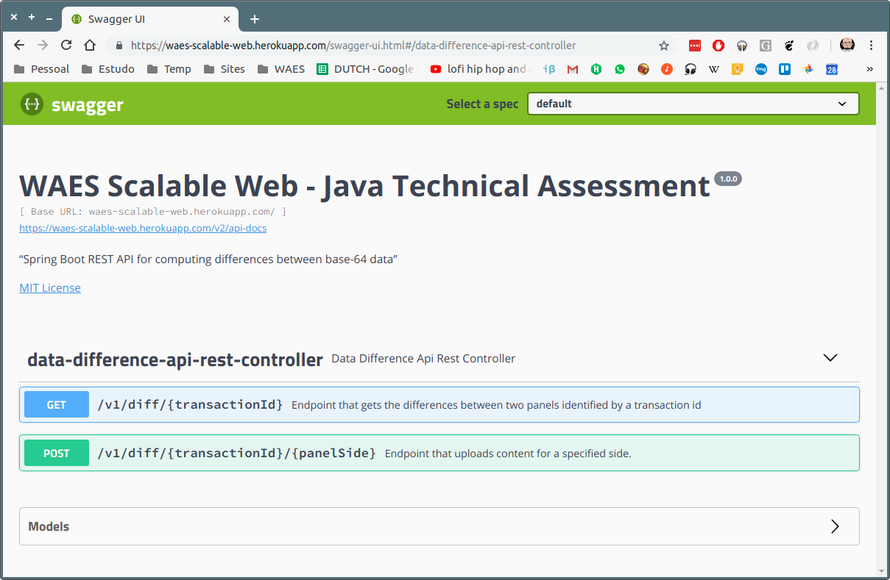

# Usage

## Project Info

It was a great pleasure for me to develop this microservice. Here I provide several ways to test it.

### Prerequisites

Depending on which way you are using to test the microservice, some dependencies should be installed.

* [cURL](https://curl.haxx.se/)
* [Git](https://git-scm.com/)
* [Docker](https://www.docker.com/)
* [Postman](https://www.getpostman.com/)
* [Java 1.8](https://www.oracle.com/technetwork/pt/java/javase/downloads/jdk8-downloads-2133151.html)
* [Maven](https://maven.apache.org/install.html)

### Server up and running

Download a local copy of the project using the following command:

```
git clone https://github.com/rsouza01/waes-scalable-web.git
```


Independent of the way you choose to deploy and test the service (Docker, Maven Spring Boot plugin or packaged Java application), the final result must be like is shown at the image bellow.


For the Heroku application, the following links are available:

* [API Swagger documentation](https://waes-scalable-web.herokuapp.com/swagger-ui.html)
* [Spring Boot Actuator - Health](https://waes-scalable-web.herokuapp.com/actuator/health)
* [Spring Boot Actuator - Info](https://waes-scalable-web.herokuapp.com/actuator/info)

For the other deploy methods:

* [API Swagger documentation](http://localhost:8080/swagger-ui.html)
* [Spring Boot Actuator - Health](http://localhost:8080/actuator/health)
* [Spring Boot Actuator - Info](http://localhost:8080/actuator/info)
* [H2 - Database console](http://localhost:8080/h2-console/)


#### Heroku

Along with the source code and instructions to test the microservice, I am also providing an instance running on [Heroku](https://www.heroku.com/), at [https://waes-scalable-web.herokuapp.com/](https://waes-scalable-web.herokuapp.com/).

#### Docker image

For testing with Docker, one has to open a terminal window at the `./tests` folder, and run the script provided. The script `publish-server-mvn.sh` will perform the tests, package, generate and run the microservice docker image at the port 8080.

```bash
$ <PROJECT_FOLDER>/tests/publish-server-mvn.sh
```
#### Maven Plugin

For testing with Maven, one has to open a terminal window at the project root folder, and run 

```bash
$ <PROJECT_FOLDER>/mvn spring-boot:run
```

#### Command line Java packaged application

Test, build, package and run.

```bash
$ <PROJECT_FOLDER>/mvn clean install && java -jar target/waes-scalable-web-0.0.1-SNAPSHOT.jar
```

### Testing

The following endpoints are available:

URL | Method | Payload | Description
--- | --- | --- | ---
`<host>/v1/diff/<TRANSACTION_ID>/left` | POST | Left JSON Base64 content  | Processes and stores the left content
`<host>/v1/diff/<TRANSACTION_ID>/right` | POST | Right JSON Base64 content | Processes and stores the right content
`<host>/v1/diff/<TRANSACTION_ID>` | GET | - | Compares contents and returns how different the contents are.


#### Postman

For tests with POSTMAN, I provide the `WAES.postman_collection.json` and two environments at the `./tests` folder (`WAES-HEROKU.postman_environment.json` and `BOOT-LOCAL.postman_environment.json`), where I assume the user is able to import.

In the images bellow, the environment WAES-Heroku is selected and a POST request is made, uploading some base-64 content to the left panel, with transaction id = 1. 


And here we can see the successful response from the application


Here I give two strings that can be used for testing purposes:

* String 1 
```json
{ \"name\":\"John\", \"age\":30, \"cars\": { \"car1\":\"Ford\", \"car2\":\"BMW\", \"car3\":\"Fiat\" } }
```

```json
eyAibmFtZSI6IkpvaG4iLCAiYWdlIjozMCwgImNhcnMiOiB7ICJjYXIxIjoiRm9yZCIsICJjYXIyIjoiQk1XIiwgImNhcjMiOiJGaWF0IiB9IH0=
```

* String 2 

```json
{ \"name\":\"Ana\", \"age\":40, \"cars\": { \"car1\":\"Ford\", \"car2\":\"BMW\" } }
```

```json
eyAibmFtZSI6IkFuYSIsICJhZ2UiOjQwLCAiY2FycyI6IHsgImNhcjEiOiJGb3JkIiwgImNhcjIiOiJCTVciIH0gfQ==
```

#### CURL Script

Finally, for tests with CURL, I provide the `./tests/run-tests-curl.sh shell` script, which reproduce the tests performed by the `mvn verify` command. The tests can be performed either locally or at Heroku, depending on the switch passed in the command line.

For the Heroku tests, run `run-tests-curl.sh` with the `-e` switch (for `external`):

```bash
$ <PROJECT_FOLDER>/tests/run-tests-curl.sh -e
```
and for local tests, run with or without the `-l` switch (for `local`):

```bash
$ <PROJECT_FOLDER>/tests/run-tests-curl.sh
```
Bellow there is an example, where I show a POST request being made, the expected HTTP status and a received HTTP status.


#### Swagger UI

And of course, the Swagger user interface, where you can send parameters directly through the application.


